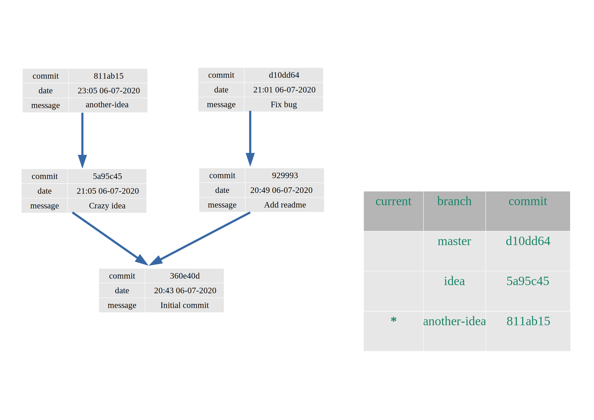
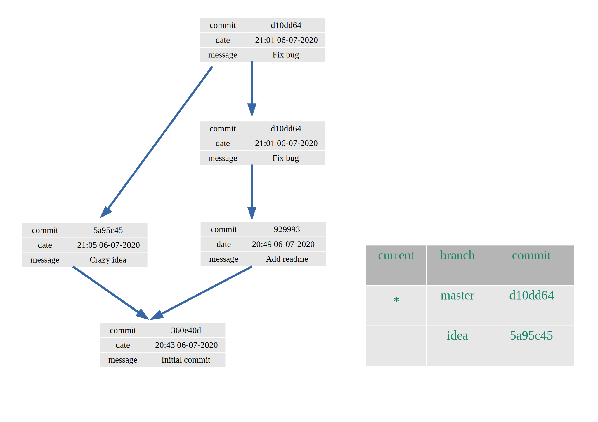
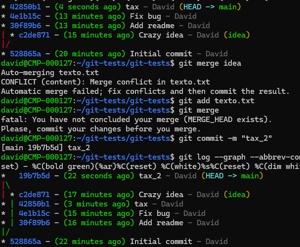
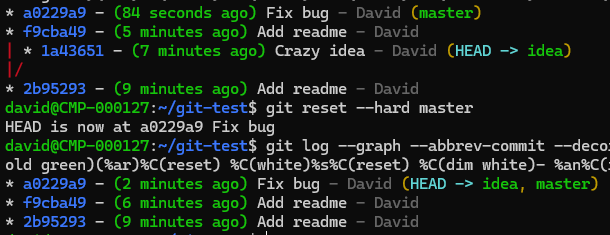

* [Ejercicio](#Ejercicio)
* [Preguntas](#Preguntas)
  * [Preguntas](#Preguntas)
    * [Pregunta 0](#Pregunta-0)
        * [Respuesta 0](#Respuesta-0)
    * [Pregunta 1](#Pregunta-1)
        * [Respuesta 1](#Respuesta-1)
    * [Pregunta 2](#Pregunta-2)
        * [Respuesta 2](#Respuesta-2)
    * [Pregunta 3](#Pregunta-3)
        * [Respuesta 3](#Respuesta-3)

### Ejercicio

Vamos a describir el estado de un repositorio de git de forma simplificada, tiene 2 partes importantes:

* el árbol de commits, que es lo que guarda [la base de datos de snapshots de git](https://git-scm.com/book/en/v2/Getting-Started-What-is-Git%3F) En el diagrama, cada commit apunta a su(s) padre(s).
* la tabla de [branches](https://git-scm.com/book/en/v2/Git-Branching-Branches-in-a-Nutshell), que dice qué branches tenemos y a qué commits apuntan

En un repositorio local, además tenemos:
* el *current branch*, el branch en el cual estamos trabajando en este momento
* el staging area
* el working directory

Hemos empezado a trabajar en un proyecto de git y está en este estado (seguimos la notación de git indicando el current branch con un asterisco). El working tree y el staging area están sin cambios.


### Preguntas:

**Todas las preguntas empiezan con el estado inicial descrito arriba**, no son cambios cumulativos.

Los diagramas son svg así que se pueden editar fácilmente con [inkscape](https://inkscape.org/); hacer un diagrama a mano y subir una foto también es una opción.

#### Pregunta 0

(Ejemplo) Supongamos que hacemos unos cambios y ejecutamos `git commit -m "Better idea"`:

Cambia el diagrama para representar el nuevo estado del repositorio.

##### Respuesta 0

NB: hay que inventarse la fecha y el hash:


#### Pregunta 1

Supongamos que tenemos otra idea, así que hacemos otro branch en este punto y cambiamos a este branch:
```
git branch another-idea
git checkout another-idea
```

Cambia el diagrama para representar el nuevo estado del repositorio: tanto el grafo de commits como la tabla de branches pueden cambiar.

##### Respuesta 1



#### Pregunta 2

Supongamos que hemos decidido integrar los cambios de la rama `idea` a `master`, así que cambiamos de rama y ejecutamos un merge:

```
git checkout master
git merge idea
```

Cambia el diagrama para representar el nuevo estado del repositorio: tanto el grafo de commits como la tabla de branches pueden cambiar.

##### Respuesta 2




#### Pregunta 3

Nos hemos bebido un par de botellas de vino y ejecutamos

```
git reset --hard master
```

Cambia el diagrama para representar el nuevo estado del repositorio: tanto el grafo de commits como la tabla de branches pueden cambiar.

Marta was here4
Jon Ander was here2

##### Respuesta 3



